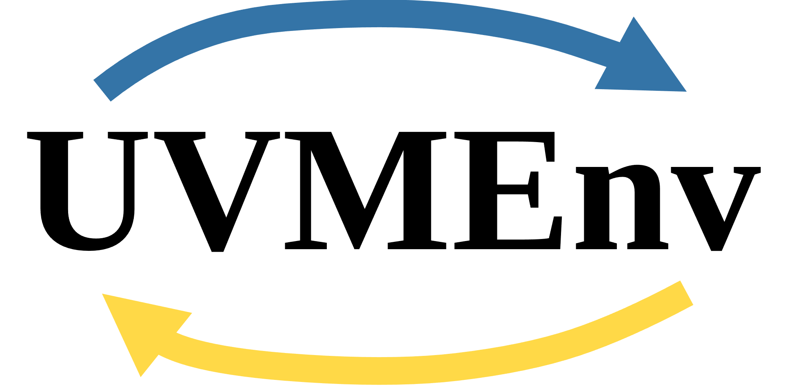

# UVMEnv

**Universal Verification Metodology Environments**

Open source framework based on Python and Universal Verification Metodology (UVM),
to generate RTL digital designs verification environments. 

**Currently developing version 2.0**

[**Instituto Politécnico Nacional (IPN).**](https://www.ipn.mx/)

[**Centro de Investigación en Computación (CIC).**](https://www.cic.ipn.mx/)

<p align="center">
  
  <br/>
  2024 - 2025
</p>

```
This repository contains academic content, you can find it into `docs` directory.
Master thesis title: "UVMEnv: Framework de código abierto, basado en Python y UVM, para generar ambientes de verificación de circuitos digitales"

- Source code is licenced under Apache 2.0 (LICENSE).
- Academic content (thesis and documentation/images into `docs` directory) is licensed under Creative Commons Attribution-NonCommercial-NoDerivatives 4.0 International [CC BY-NC-ND 4.0] (LICENSE-CC.md).

Attribution is required in both of cases.

```
<a href="https://github.com/ManBenit/uvmenv/">UVMEnv: Framework de código abierto, basado en Python y UVM, para generar ambientes de verificación de circuitos digitales</a> © 2024 por <a href="https://www.linkedin.com/in/manbenit/">Manuel Emilio Benítez Morales</a> está licenciado bajo <a href="https://creativecommons.org/licenses/by-nc-nd/4.0/">Creative Commons Attribution-NonCommercial-NoDerivatives 4.0 International</a>


-----

`UVMEnv` is intended for easy UVM environments creation, using a screaming architecture and  working by projects with a general 
hierarchy based on [UVM standard 1.2](https://accellera.org/images/downloads/standards/uvm/uvm_users_guide_1.2.pdf), 
making directly understandable the `UVMEnv` project structure (files and directories) with the hierarchy, supported
by the command [user interface](https://github.com/ManBenit/uvmenv/blob/main/docs/usr_itface.md).

In other words: seeing the `UVMEnv` main hierarchy, get exactly which part of project structure is necessary to edit and
which is its hierarchy level.


## Requirements

- Linux Debian based distribution.

- Python 3.10 or later.

## Sections
- [`UVMEnv` main structure](https://github.com/ManBenit/uvmenv/blob/main/docs/main_structure.md).
- [Install/Uninstall](https://github.com/ManBenit/uvmenv/blob/main/docs/installation.md).
- [User interface](https://github.com/ManBenit/uvmenv/blob/main/docs/usr_itface.md).
- [Generic testbench](https://github.com/ManBenit/uvmenv/blob/main/docs/generic_tb.md).
- [Project configuration](https://github.com/ManBenit/uvmenv/blob/main/docs/project_configuration.md).
- [Files classification](https://github.com/ManBenit/uvmenv/blob/main/docs/files_classification.md).
- [Directories classification](https://github.com/ManBenit/uvmenv/blob/main/docs/dirs_classification.md).
- [Naming conventions](https://github.com/ManBenit/uvmenv/blob/main/docs/name_conventions.md).


