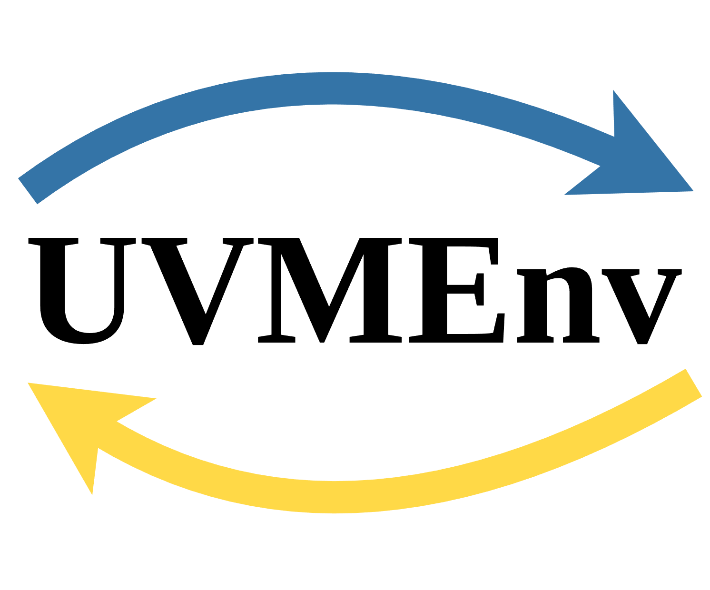

# UVMEnv

**Universal Verification Metodology Environments**

Open source framework based on Python and Universal Verification Metodology (UVM),
to generate RTL digital designs verification environments. 

<p align="center">
  
  <br/>
  2024 - 2026
</p>


`UVMEnv` is intended for easy and fast creation of UVM environments, preconnected and ready to run, using a screaming architecture and  working by projects with a general 
hierarchy based on [UVM standard 1.2](https://accellera.org/images/downloads/standards/uvm/uvm_users_guide_1.2.pdf), 
making directly understandable the `UVMEnv` project structure (files and directories) with the hierarchy, supported
by the command [user interface](https://github.com/ManBenit/uvmenv/blob/uvmenv-2.0/docs/usr_itface.md).

In other words: seeing the `UVMEnv` main hierarchy, get exactly which part of project structure is necessary to edit and
which is its hierarchy level.

## What is new
- It is necessary to edit less files to run a successfully UVM environment (before, 10 for sequential and 5 for combinatorial; now, 5 for both of them and optionally configuration file).
- Parametrized to run behaviour accorning to type of design (combinatorial/sequential) only changing `config.json`.
- Compiled instead of interpreted code base, so now is faster.
- Better organization of user interface options.
- Changed files classification.
- Autocompleted default coverage.
- First general scoreboarding (comparing all inputs and outputs are the same between reference model and DUT).
- Multi-platform support and adaptation to any Linux distro (in development process).
- Dockerized mechanism to start on Linux or Windows (Docker instalation is required).
- Default prefixed for UVM components and default format to keep a good linting.
- And more...


## Requirements
- Linux distribution.
- Python 3.10 or later.
- GCC 13.X or later.
- Docker installation (if you want to run as container)

## Sections
- [`UVMEnv` main structure](https://github.com/ManBenit/uvmenv/blob/uvmenv-2.0/docs/main_structure.md).
- [Install/Uninstall](https://github.com/ManBenit/uvmenv/blob/uvmenv-2.0/docs/installation.md).
- [User interface](https://github.com/ManBenit/uvmenv/blob/uvmenv-2.0/docs/usr_itface.md).
- [Generic testbench](https://github.com/ManBenit/uvmenv/blob/uvmenv-2.0/docs/generic_tb.md).
- [Project configuration](https://github.com/ManBenit/uvmenv/blob/uvmenv-2.0/docs/project_configuration.md).
- [Files classification](https://github.com/ManBenit/uvmenv/blob/uvmenv-2.0/docs/files_classification.md).
- [Directories classification](https://github.com/ManBenit/uvmenv/blob/uvmenv-2.0/docs/dirs_classification.md).
- [Naming conventions](https://github.com/ManBenit/uvmenv/blob/uvmenv-2.0/docs/name_conventions.md).


## More excercices
- [Verilog to `UVMEnv`](https://github.com/ManBenit/v2uvmenv).


## Extra information
```
This repository contains on its origin academic content, you can find it into `docs` directory since version 1.0.

Source code is licenced under Apache 2.0 (LICENSE).

Documentation content is licensed under Creative Commons Attribution-NonCommercial-NoDerivatives 4.0 International [CC BY-NC-ND 4.0] (LICENSE-CC.md).

Attribution is required in both of cases.

```
<a href="https://github.com/ManBenit/uvmenv/">UVMEnv: Framework de código abierto, basado en Python y UVM, para generar ambientes de verificación de circuitos digitales</a> © 2026 by <a href="https://www.linkedin.com/in/manbenit/">Manuel Emilio Benítez Morales</a> is licensed under <a href="https://creativecommons.org/licenses/by-nc-nd/4.0/">Creative Commons Attribution-NonCommercial-NoDerivatives 4.0 International</a>


