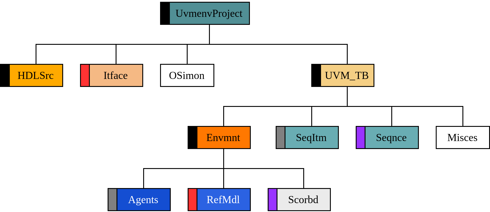
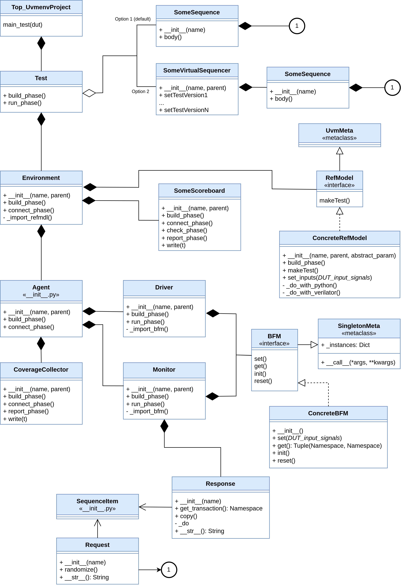

# UVMEnv
*Universal Verification Metodology Environments*

Open source framework based on Python and Universal Verification Metodology (UVM),
to generate RTL digital designs verification environments.

**Instituto Politécnico Nacional (IPN).**

**Centro de Investigación en Computación (CIC).**

*2024 - 2025*


## Requeriments

- Linux Debian based distribution.

- Python 3.10.X.
  
  ```Note:``` If you have a later Python version, you will need to create a virtual environmentbefore run the installer.


## Install
Run: ```./install.sh [update]```

The installation path is ```/home/your_user/.UVMEnv```. Inside of this directory you must view 
the next subdirectories:
- ```bases```: Templates for code generation.
- ```repos```: Where util repositories (currently Verilator and Icarus) are located.
- ```tools```: Scripts for run verification and user interface source.

The optional parameter ```update``` will run a system update, and replacement of 
installation files, also will update base simulators (Verilator and Icarus) and update
Cocotb and PyUVM versions.

After your installation you should have available the ```uvmenv``` command,
test typing ```uvmenv --help```.


## Uninstall
Run ```./uninstall.sh [all]```.

By default, this script will uninstall only the ```UVMEnv``` components but it will keep the rest
of elements (dependencies, simulators, etc.)

If you use the ```all``` option, then every dependencies, tools and simulators.

## User interface
- Framework management.
- Components handling.
- [View more](https://github.com/ManBenit/uvmenv/blob/main/docs/usr_itface.md)

## Generic testbench
- Create project.
- Save DUT.
- Init project.
- Run verification.
- [View more](https://github.com/ManBenit/uvmenv/blob/main/docs/generic_tb.md)

## Files and directories classification
- Implementation directory
- Multiple files directory.
- [View more](https://github.com/ManBenit/uvmenv/blob/main/docs/classification_dirs.md)
- Base created files.
- Full created files.
- Partially created files.
- [View more](https://github.com/ManBenit/uvmenv/blob/main/docs/classification_files.md)

## Naming conventions
- For directory components.
- For implemented components.
- For component files.
- [View more](https://github.com/ManBenit/uvmenv/blob/main/docs/name_conventions.md)


## Projects
When you create a new project (```uvmenv --new```), you should see the next directory hierarchy:
<p align="center">
  
  
</p>

They match with the main UVM hierarchy, based and implemented on screaming architecture:


Inside Environment, UVMEnv uses the next TLM communication:


To be able for understading instances of ```UVMEnv```, this is the class diagram:



