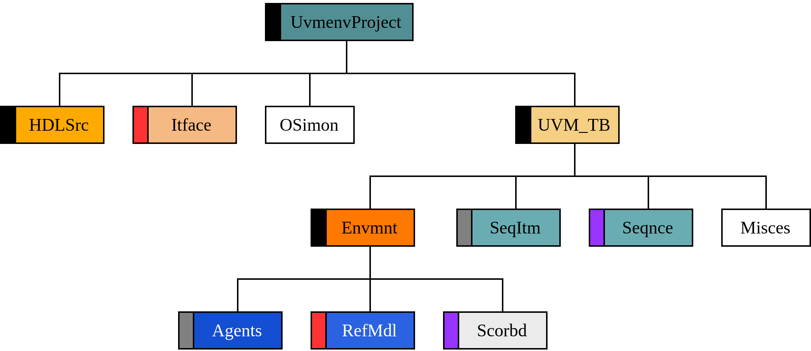

## Directories details

  
  

- They are named under the following rules:
  - With 6 characters following the **PascalCase** convention while preserving acronyms, except for the `UVM_TB` directory which follows the **screaming_snake_case** convention, and the `_impl` directories, which preserve 5 characters.
  - Phonetic abbreviations are used to achieve the 6-character naming, for example, `Itface` for Interface.

- Each of these directories, including the `_impl` directories, are created only when starting a new `UVMEnv` project.

- The component directories are created using the user interface and are governed by the rules described 
[here](https://github.com/ManBenit/uvmenv/blob/main/docs/classification_files_func_base_components.md).

### `UvmenvProject`
The root of the project created with `UVMEnv`; the actual name of this directory is assigned at the time of creation and should follow the **PascalCase** convention.

### `HDLSrc`
**HDL source** directory. It houses the source code of the design described in a hardware description language. In other words, it contains the **DUT**.

### `Itface`
**Interface** directory. It contains the interface (object-oriented programming concept) of the BFM to communicate the DUT with the verification environment.

### `OSimon`
**Output simulation** directory. All resulting files from the verification are stored here: the waveform and the generated UVM report.

### `UVM_TB`
**Universal Verification Methodology Testbench** directory. Represents the **Test** level in the 
[main structure](https://github.com/ManBenit/uvmenv/blob/main/docs/main_structure.md) 
and contains the necessary UVM components to verify the DUT.

### `Envmnt`
**Environment** directory. Represents the homonymous level in the 
[main structure](https://github.com/ManBenit/uvmenv/blob/main/docs/main_structure.md).

### `Agents`
**Agents** directory. Contains the agents necessary for verification. Each agent is represented by a subdirectory where the monitor, sequencer, and coverage collector are stored. This is detailed in the 
[files section](https://github.com/ManBenit/uvmenv/blob/main/docs/classification_files.md).

### `RefMdl`
**Reference model** directory. Contains the interface (object-oriented programming concept) of the reference model that will be used to compare results.

### `Scorbd`
**Scoreboard** directory. Contains the different scoreboards that may be used in the project.

### `Misces`
**Miscellaneous** directory. This directory contains **extra** definitions and functionalities not defined by the environment and its standard but that provide helpful features, such as auxiliary classes, object encapsulation (new data types), instance renaming, etc. It is not included in the 
[main structure](https://github.com/ManBenit/uvmenv/blob/main/docs/main_structure.md), 
but it is used logically.

### `SeqItm`
**Sequence item** directory. Contains the sequence items necessary for verification, each one is represented by a subdirectory where request and response are stored. This is detailed in the 
[files section](https://github.com/ManBenit/uvmenv/blob/main/docs/classification_files.md).

### `Seqnce`
**Sequence** directory. Contains the different sequences that may be used in the project.

