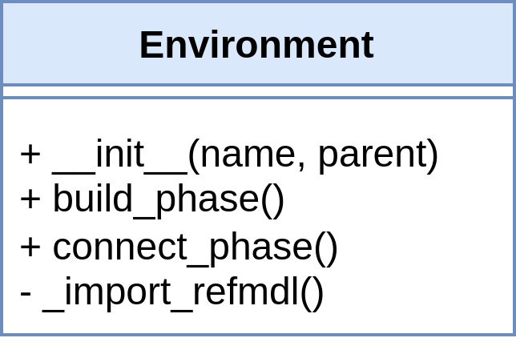
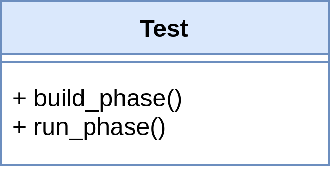
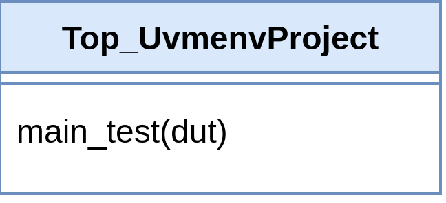

### Representative base files

| Directorio en repositorio        | Directorio de instalación          |
|----------------------------------|------------------------------------|
| `uvmenv_bases/representative_files`     | `~/.UVMEnv/bases/representative_files`    |

Represent directly the UVM hierarchy level of the 
[main structure](https://github.com/ManBenit/uvmenv/blob/main/docs/main_structure.md)
and abstracted main directories, except for the one of the `dut`.

These files clearly contain the connections made between the 3 general levels of UVM within the entire generated environment.

- `EnvironmentBase.py`: Will become `Environment.py` and contains the instances of scoreboards and agents. It will be stored in the representation directory `Envmnt`.

    

- `TestBase.py`: Will become `Test.py` and contains the instances of the environment and sequences. It will be stored in the representation directory `UVM_TB`.

    

- `TopBase.py`: Will become `Top_ProjectName`, where `ProjectName` is assigned by the user when creating the project and this file makes the instance of `test`. It will be stored at the root (`UvmenvProject`).

    

