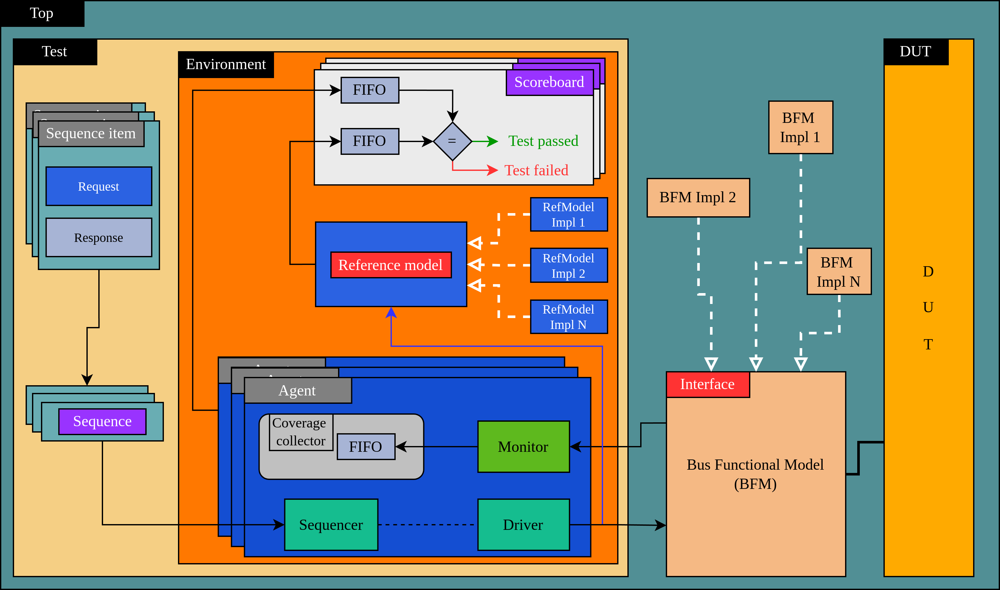

<p align="center">
  
  
</p>

### Partially created files
They may or may not contain keywords in their base version, and once the substitution is performed, the result is a partially written file that the user can "fill in" with the necessary code to fulfill their verification plan.

To assist in writing, these files contain instructions and fill-in examples in the comments to facilitate their implementation.

- `TestBase.py`
- `EnvironmentBase.py`
- `ScoreboardBase.py`
- `SequenceBase.py`
- `RefmodelImplBase.py`
- `AgentCoverageCollectorBase.py`
- `AgentMonitorBase.py`


Here is a fragment of reference model implementation code:

Firstly when it is on his base version:
```python
class CLASS_NAME(RefModel):
    ...
    def _do_with_python(self): 
        """Write here your model handling""" 
        
        
        # Finally return the result to compare 
        # (assign your correct values)
        return {
RETURNS
        }
```

And then the version after substitution process:
```python
class RefModelNew(RefModel):
    ...
    def _do_with_python(self): 
        """Write here your model handling""" 
        y = self.a + self.b # This line was written by user
        
        # Finally return the result to compare 
        # (assign your correct values)
        return {
            'y': y
        }
```


