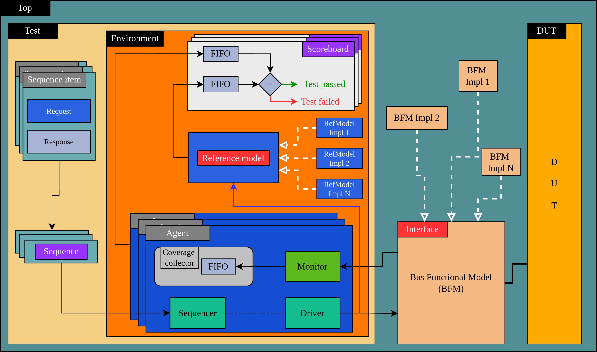
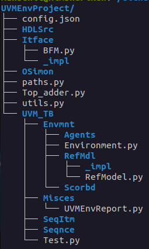

## Files classification

  
  

In general, file creation is performed through the user interface and
is based on preassembled code templates. As a result, even if only an empty environment
is generated, it will run correctly (See the [generic testbench](https://github.com/ManBenit/uvmenv/blob/main/docs/generic_tb.md)).

This implementation approach leverages the repetitive and pattern-based nature of
software for UVM because it follows a standard.
The operation method involves placing keywords in the templates, following the `screaming_snake_case` convention,
which will be replaced through the user interface.

## Abstract
| **Name**                     | **Functionality: Base**  | **Functionality: Tool**  | **Malleability: Base created**   | **Malleability: Fully created**  | **Malleability: Partially created**  |
|------------------------------|--------------------------|--------------------------|----------------------------------|----------------------------------|--------------------------------------|
| **command.sh**               |                          | ✅                       |                                  |                                  |                                      |
| **run.sh**                   |                          | ✅                       |                                  |                                  |                                      |
| **uninstall.sh**             |                          | ✅                       |                                  |                                  |                                      |
| **getSignalsBase.py**        | comnd                    |                          |                                  |                                  |                                      |
| **writeVcdPart**             | comnd                    |                          |                                  |                                  |                                      |
| **AgentBase.py**             | comp                     |                          | ✅                               |                                  |                                      |
| **AgentCoverageCollectorBase.py** | comp                |                          |                                  |                                  | ✅                                   |
| **AgentDriverBase.py**       | comp                     |                          |                                  | ✅                               |                                      |
| **AgentMonitorBase.py**      | comp                     |                          |                                  |                                  | ✅                                   |
| **BFMBase.py**               | comp                     |                          | ✅                               |                                  |                                      |
| **BFMImplBase.py**           | comp                     |                          |                                  | ✅                               |                                      |
| **RefmodelBase.py**          | comp                     |                          | ✅                               |                                  |                                      |
| **RefmodelImplBase.py**      | comp                     |                          |                                  |                                  | ✅                                   |
| **ScoreboardBase.py**        | comp                     |                          |                                  |                                  | ✅                                   |
| **SequenceBase.py**          | comp                     |                          |                                  |                                  | ✅                                   |
| **SeqItemBase.py**           | comp                     |                          | ✅                               |                                  |                                      |
| **SeqItemRequestBase.py**    | comp                     |                          |                                  | ✅                               |                                      |
| **SeqItemResponseBase.py**   | comp                     |                          |                                  | ✅                               |                                      |
| **PathsFileBase.py**         | conf                     |                          | ✅                               |                                  |                                      |
| **UtilsFileBase.py**         | conf                     |                          | ✅                               |                                  |                                      |
| **EnvironmentBase.py**       | rep                      |                          |                                  |                                  | ✅                                   |
| **TestBase.py**              | rep                      |                          |                                  |                                  | ✅                                   |
| **TopBase.py**               | rep                      |                          | ✅                               |                                  |                                      |

where, at `Fucntionality: Base`:
- comnd -> *command*.
- comp -> *component*.
- conf -> *configuration*.
- rep -> *representative*.

Each file into `UVMEnv` can be classified in different ways, according different characteristics:

### By functionality
This classification refers to the role of files when executing and managing
a verification environment from their handling through the user interface
to their use as execution aids or UVM components abstracted as
[main structure](https://github.com/ManBenit/uvmenv/blob/main/docs/main_structure.md) ilustrates.

#### Base files
It's the fundamental characteristic of `UVMEnv` to create verification environments (creating and managing projects and UVM components). 

This code can be rewritten with DUT signals got from Verilator when it contains `KEY_WORDS` or have coding instructions (on comments) for creating each environment component. 

- [Commands](https://github.com/ManBenit/uvmenv/blob/main/docs/files_classification/functionality/base_commands.md).
- [Components](https://github.com/ManBenit/uvmenv/blob/main/docs/files_classification/functionality/base_components.md).
- [Configurations](https://github.com/ManBenit/uvmenv/blob/main/docs/files_classification/functionality/base_configurations.md).
- [Representatives](https://github.com/ManBenit/uvmenv/blob/main/docs/files_classification/functionality/base_representatives.md).

#### Tool files
Contain the necessary functionality for the user interface. They are copied directly into the installation directory.

| Directorio en repositorio        | Directorio de instalación          |
|----------------------------------|------------------------------------|
| `uvmenv_bases/config_files`     | `~/.UVMEnv/bases/config_files`|

- `command.sh`: This is the command user interface that allows to interact and  properly use `UVMEnv`.

- `run.sh`: Contains the instructions to create the necessary `Makefile` to start the verification process, as well as to clean up autogenerated and cache files.

- `uninstall.sh`: This is the uninstallation script in case it is needed.

### By malleability
This classification refers to the way the final files are written, which are used by the user to carry out the verification process.

- [Base created](https://github.com/ManBenit/uvmenv/blob/main/docs/files_classification/malleability/base_created.md).
- [Fully created](https://github.com/ManBenit/uvmenv/blob/main/docs/files_classification/malleability/fully_created.md).
- [Partially created](https://github.com/ManBenit/uvmenv/blob/main/docs/files_classification/malleability/partially_created.md).

