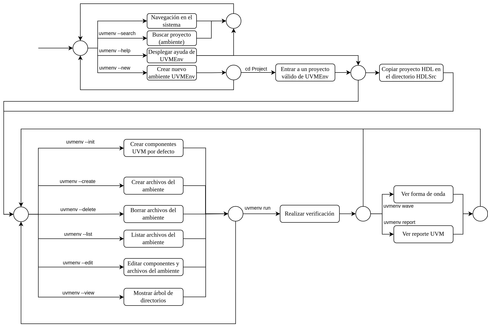

## Internal description for `UVMEmv`
`UVMEnv` takes fundamental concepts of Cocotb, UVM standard and its own definitions and design rules; since UVMEnv is an independent project, then exist a description focus on this framework and one about Cocotb functionality, which was strongly analyzed for `UVMEnv` development.

- [Here main description](https://github.com/ManBenit/uvmenv/blob/main/docs/main_structure/index.md).
- [Here main extra description (Cocotb structure)](https://github.com/ManBenit/uvmenv/blob/main/docs/main_structure/extra/index.md).

  

