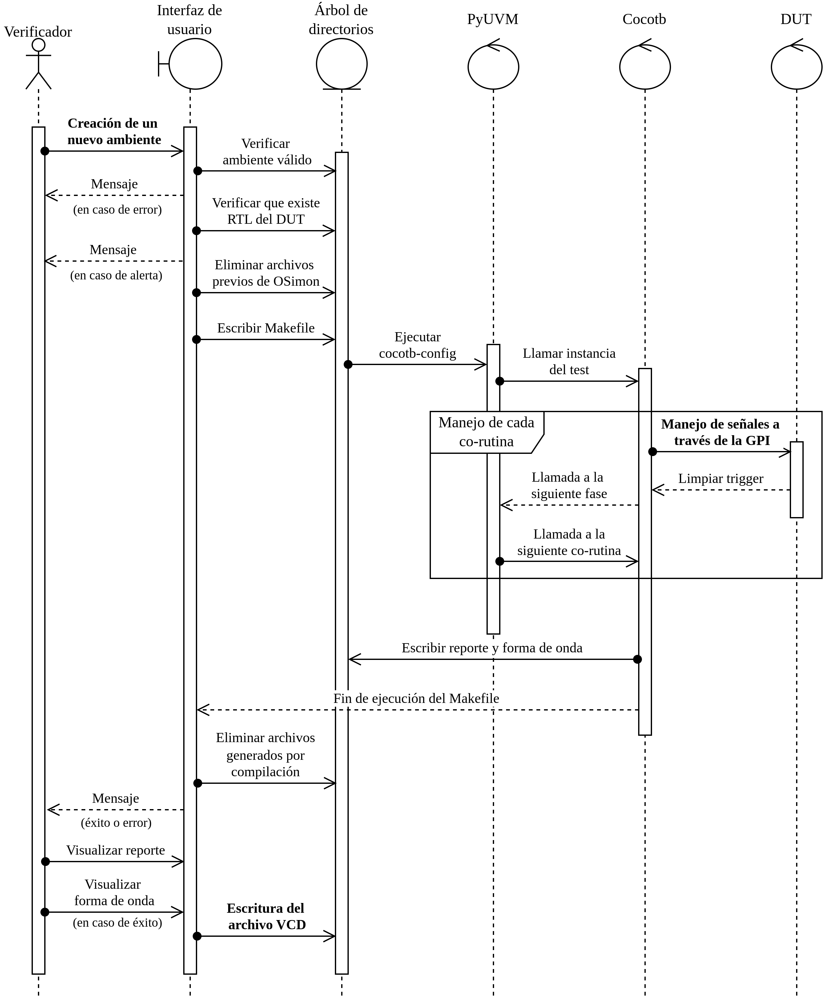

## General work of `UVMEnv`

The next sequence diagram describes all framework functionality, in a general way:

  

Each remarked phase have its own description:
- [New environment creation](https://github.com/ManBenit/uvmenv/blob/main/docs/opp_description/XXXX.md).
- [Signals handling using GPI](https://github.com/ManBenit/uvmenv/blob/main/docs/opp_description/XXXX.md).
- [Writing of VCD file](https://github.com/ManBenit/uvmenv/blob/main/docs/opp_description/XXXX.md).

