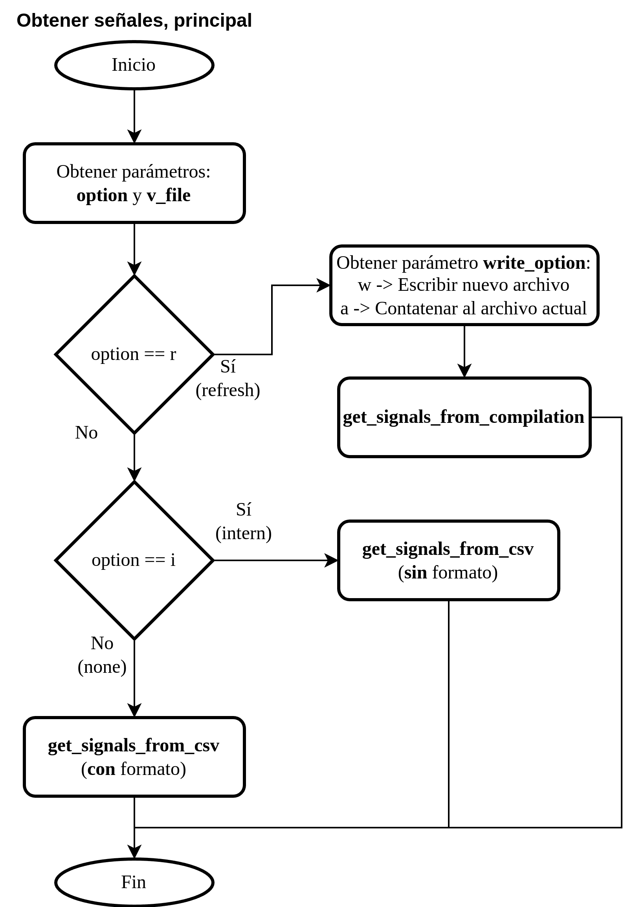
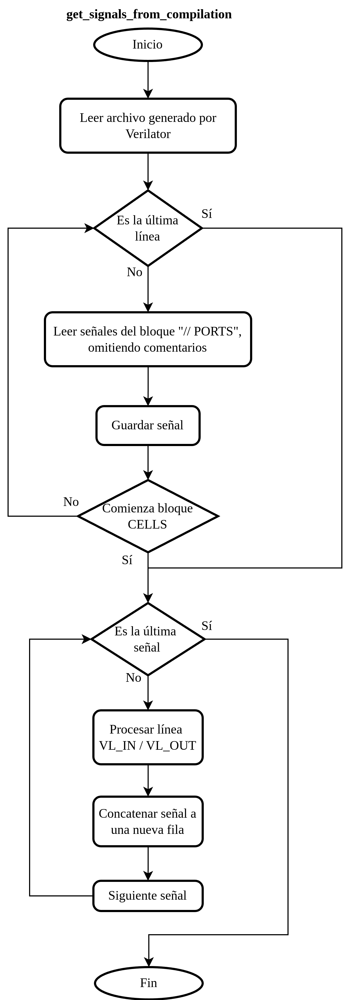
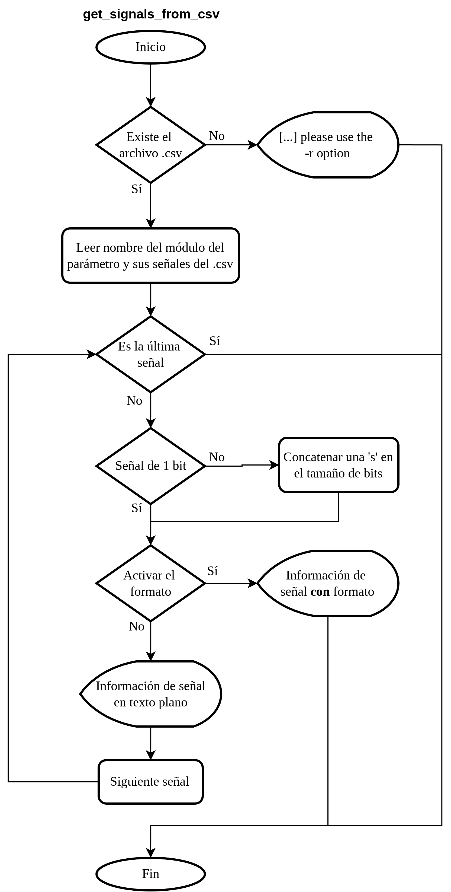

## Signals getting

  

As is visible, you can get signals of each module:
- [By compilation](#get-signals-by-compilation) or
- [By .csv](#get-signals-by-csv).

If it is the first time signal data is being retrieved, DUT is compiled with **Verilator** through the user interface . Then, using **signals.py**, the generated **.cpp** files are scanned to find a file like **VMyDesign.cpp**, and the signal information for each module is saved to the file **.allSignals.csv**, which is also showed in the console.

  

On the other hand, if the **.csv** file was already generated, it is used directly instead of recompiling the design. This enables fast access to the signal information, which can then be showed to the user.

  

