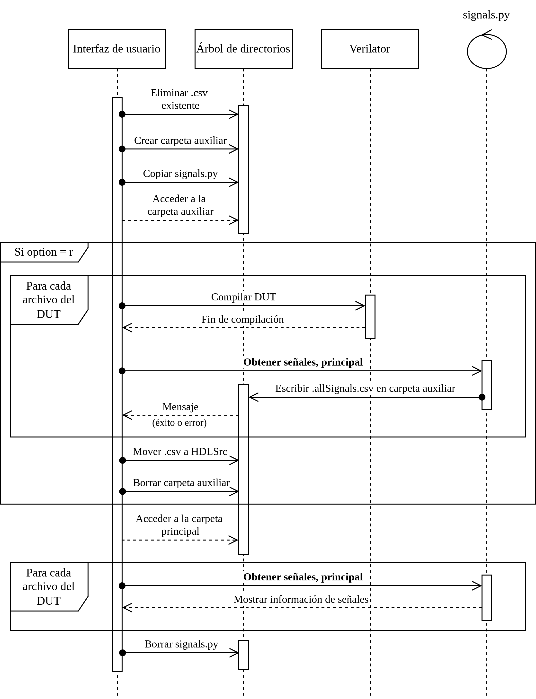

## Signals getting process of `UVMEnv`

To create the default components (see partially and fully created
[base components](https://github.com/ManBenit/uvmenv/blob/main/docs/usr_itface.md)
)
during the environment initialization, it is necessary to retrieve the signals from the DUT modules.

`UVMEnv` provides an easy-to-use mechanism to query the signals (see 
[user interface](https://github.com/ManBenit/uvmenv/blob/main/docs/usr_itface.md),
option `-l`). 
This is possible by compiling the DUT using `Verilator` or by reading the `.csv` file through the `getSignalsBase.py` script, which is renamed as `signals.py`
(see [base files commands](https://github.com/ManBenit/uvmenv/blob/main/docs/files_classification/functionality/base_commands.md)).
when copied into the project.

  

[Here details of main signals getting](https://github.com/ManBenit/uvmenv/blob/main/docs/files_classification/functionality/base_commands.md)

