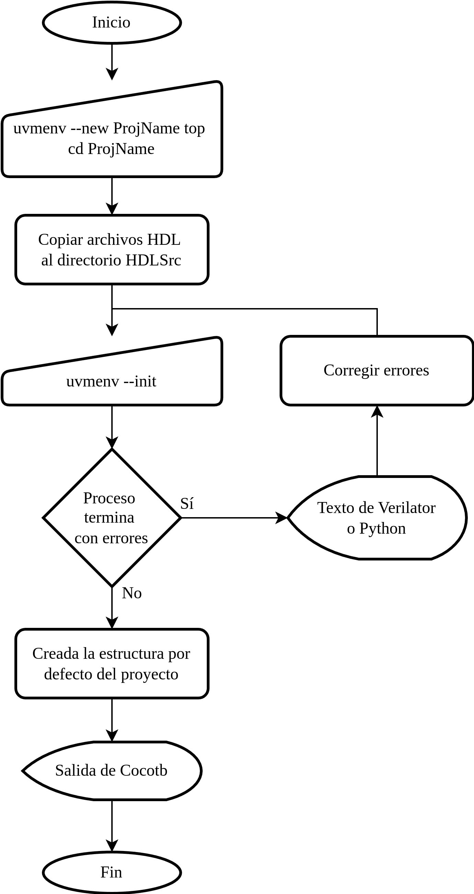

## New environment creation

For creating a new generic project (environment or testbench) you need using the 
[user interface](https://github.com/ManBenit/uvmenv/blob/main/docs/usr_itface.md), in general steps for this creation are described by the next diagram:

  

Optionally, you can use `uvmenv --view` for seeing your current project structure.

