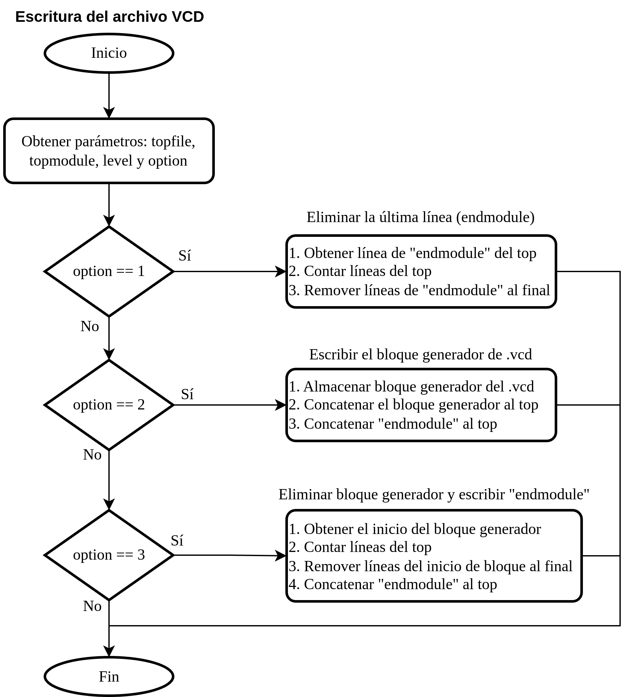

## Writing of VCD file


To write the `.vcd` file that enables waveform visualization, the `$dumpfile` directive is used through the `writeVcdPart.py` script, which becomes `vcdWriter.py`. Its behavior is described in 
[base files commands](https://github.com/ManBenit/uvmenv/blob/main/docs/files_classification/functionality/base_commands.md).


This directive allows waveform generation with a depth level chosen by the user. To do this, the `wave` option is used as follows:

```
uvmenv wave N
```

where `N` is an integer that represents the hierarchy level (i.e., if `N=2`, then waveforms will be generated for the first two hierarchical levels of DUT).

By default, `N` has a value of 1, and the result will be the same whether the value is explicitly set or omitted.

<p align="center">
  
</p>