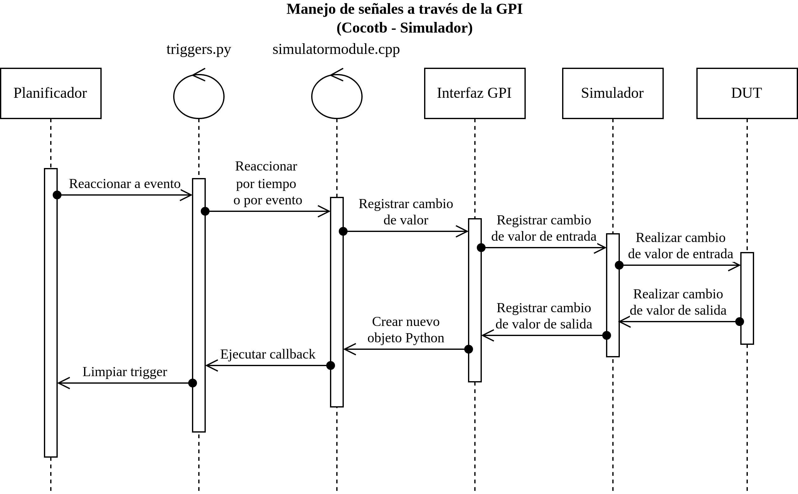

## Signals handling using GPI

GPI modules are essential for connecting the simulation with Python because they allow the code to interact with the simulator by reading and writing signals in the HDL design, as well as handling simulator events.

In general, the flow works as follows:

1. The simulator (ModelSim, Questa, VCS, etc.) runs the HDL simulation and advances the simulation time.
2. The GPI module (written in C++) acts as an abstraction layer that communicates with the simulator through standard interfaces (VPI/DPI/FLI).
3. Cocotb's scheduler receives events from the GPI and "decides" which test coroutines to execute.
4. Python coroutines control the design by simulating stimuli and checking responses.

These communication interfaces serve the purpose of connecting the simulator and Cocotb as described in the following figure:

  

