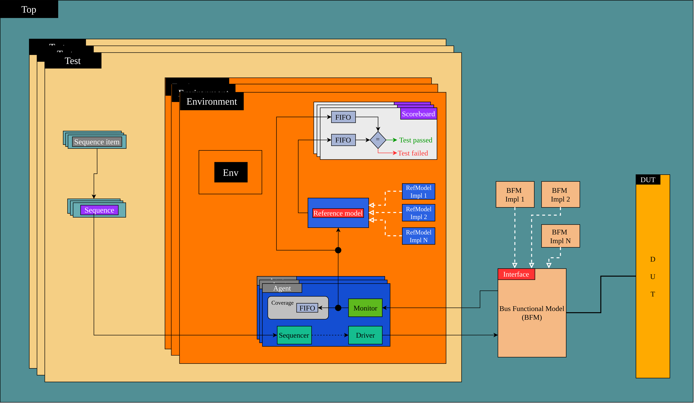
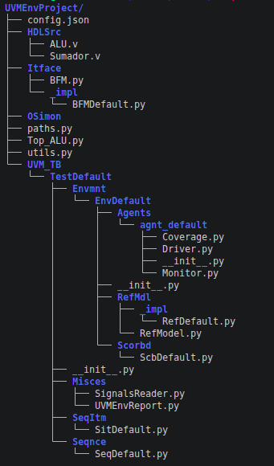
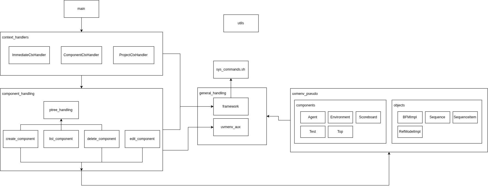

# What is
UVMEnv is an open-source and console based framework to be able to create full UVM environments easily and ready to use/develop.

# Philosophy (1)
- Easy and agile creation of UVM environments using Python. 
<!-- \pause -->
- Easy to use/understand for new users but useful for experimented ones
<!-- \pause -->
- Congruent, consistent and sustainable architecture between abstract design and filesystem tree.
<!-- \pause -->
- Keep good practices on naming, coding, component organization, UVM standard usage, software architecture, etc.
<!-- \pause -->
- Make an easy but very effective name reference between components and projects.

# Philosophy (2)
- Focus the user on verification process and not on environment creation/configuration.
<!-- \pause -->
- High project parametrization and interactivity for decreasing manual coding. 
<!-- \pause -->
- Auto-handled control signals and behavior according to combinatorial and sequential designs.
<!-- \pause -->
- Easy usage of tool, be able to do/handle everything since project root path.

# Philosophy (3)
- Make good UVM base environments for very simple and very complex designs.
<!-- \pause -->
- Make a fully reusable environment/project, since perspective UVM standard and since perspective of software development.

# Philosophy (4)
- Make tool for decreasing usage complexity and increasing capabilities.
<!-- \pause -->
- Leverage all tools provided on Python language.

# Software architecture (1)
\framesubtitle{Python}
**Clean architecture**

{height=5cm}
{height=5cm}

## Scope
\tiny
UVM environment; UVM functionality; Environment components usage

# Software architecture (2)
\framesubtitle{C++}
**Header/Source Split** ; **Modular architecture based on feature-driven** ; **UVM-based pseudo-factory**

{height=4.5cm}

## Scope
\tiny
Environment handling; Start of simulation; Code writing; Read/write signal names/lengths/types.

# Current capabilities (1)
\framesubtitle{From version 1.0}
\footnotesize
- Fast UVM environment creation.
<!-- \pause -->
- UI to easy project management.
<!-- \pause -->
- .csv file generated for faster signal information reading.
<!-- \pause -->
- Components handling helped with .yml file to describe the current state of project.
<!-- \pause -->
- Configuration file to customize behavior, instances, names and tools used on project.
<!-- \pause -->
- Immediate Top, utils and paths file to handle the scope and utilities usage on project.
<!-- \pause -->
- Creation of multiple components: test, environment, scoreboard, agent.
<!-- \pause -->
- Creation of polymorphic reference model into each environment.
<!-- \pause -->
- Creation of polymorphic BFM but this will be changed to different BFM interfaces (not singleton).

# Current capabilities (2)
\framesubtitle{From version 1.0}
\footnotesize
- Support for environment into another but not yet managed with UI.
<!-- \pause -->
- Support for any kind of RTL code. Can be in a single file, divided files or subdirectories made, you need only put it into `HDLSrc`.
<!-- \pause -->
- Directory focused on save simulation results, currently coverage resume, UVM report and wave dump on VCD format.
<!-- \pause -->
- Pre-structured directory tree to ensure consistence on all the environment. Based on clean architecture to have a clear idea.
<!-- \pause -->
- Automatic writing of files (see files classification), including signal names, keeping coherence and well relation between components.
<!-- \pause -->
- Leverage Python characteristics to reduce code on sequence bodies.
<!-- \pause -->
- Connection of external technologies for reference model using th polymorphic reference model. By default you can have a Python or Verilog/SystemVerilog model (which must be compiled into .so file).

# Current capabilities (3)
\framesubtitle{On development}
\footnotesize
- Make BFM as different objects and not polymorphic.
<!-- \pause -->
- Creation per module (currently all generated signal names fot components creation is based on top module only).
<!-- \pause -->
- Handling for Miscelaneous files (currently available list only).
<!-- \pause -->
- Use names for control signals (clock and reset) since configuration file to avoid the needing of edit these names on code.
<!-- \pause -->
- Add again support for "refresh" option when loading signals.
<!-- \pause -->
- Support for adding external reference models connections by using UI.
<!-- \pause -->
- Easy change of simulation tool through configuration file.
<!-- \pause -->
- Use new characteristics of Cocotb 2.0 to make base files.

# Coexistence with SystemVerilog-

